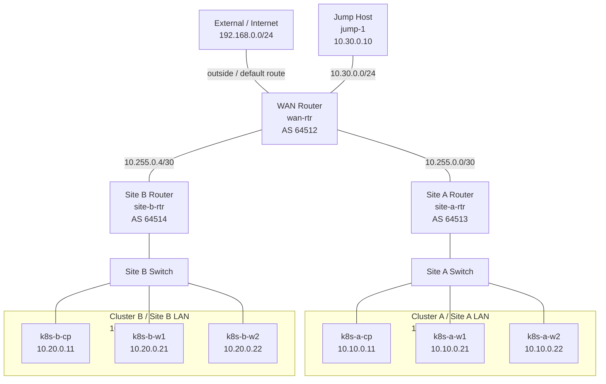
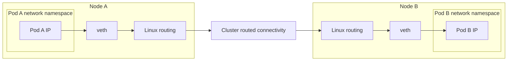
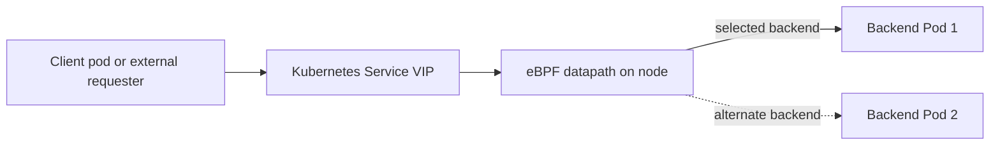
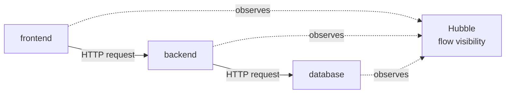
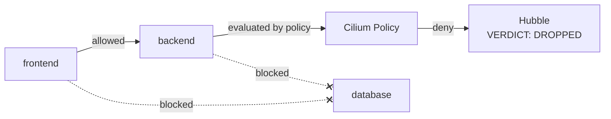
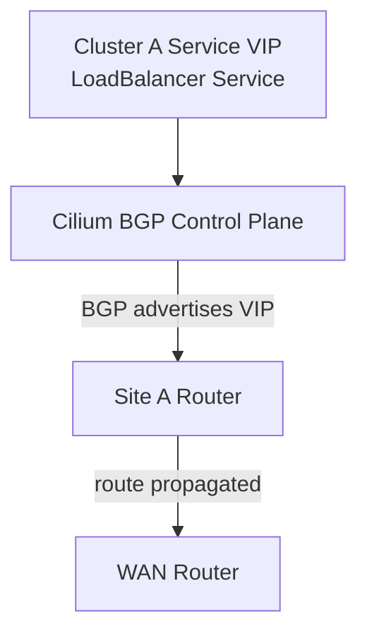
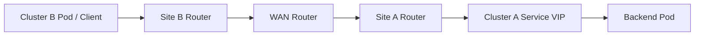
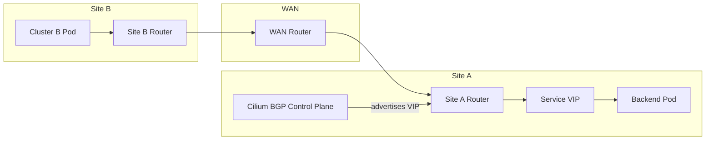

# Mermaid Diagram Definitions  
## Modeling Cloud-Native Networking with Kubernetes, Cilium, and Cisco Modeling Labs

These Mermaid definitions are intended as first-pass diagram sources for programmatic slide generation.  
They follow the actual lab topology from `topology.yaml` and the demo progression from the session plan. :contentReference[oaicite:0]{index=0} :contentReference[oaicite:1]{index=1}

---

# Diagram 1 — Full Lab Topology



---

# Diagram 2 — Pod Networking Fundamentals



---

# Diagram 3 — Service VIP and eBPF Load Balancing



---

# Diagram 4A — Observability View with Hubble



---

# Diagram 4B — Identity-Based Policy Enforcement



---

# Diagram 5A — BGP Service Advertisement



---

# Diagram 5B — Cross-Site Routed Service Reachability



---

# Diagram 5C — Demo 5 Full Context



---

# Optional Styling Starter

If your Mermaid renderer supports class definitions, you can extend diagrams like this:

```mermaid
classDef infra fill:#e8f1fb,stroke:#2b5c88,stroke-width:1px;
classDef workload fill:#eef8ea,stroke:#4d7c0f,stroke-width:1px;
classDef service fill:#fff4d6,stroke:#b7791f,stroke-width:1px;
classDef observe fill:#f3e8ff,stroke:#7c3aed,stroke-width:1px;
classDef deny fill:#fde8e8,stroke:#b91c1c,stroke-width:1px;
```

Suggested mapping:
- routers, switches, jump host, external = `infra`
- pods and application tiers = `workload`
- service VIP = `service`
- Hubble and observability elements = `observe`
- drop / deny elements = `deny`

