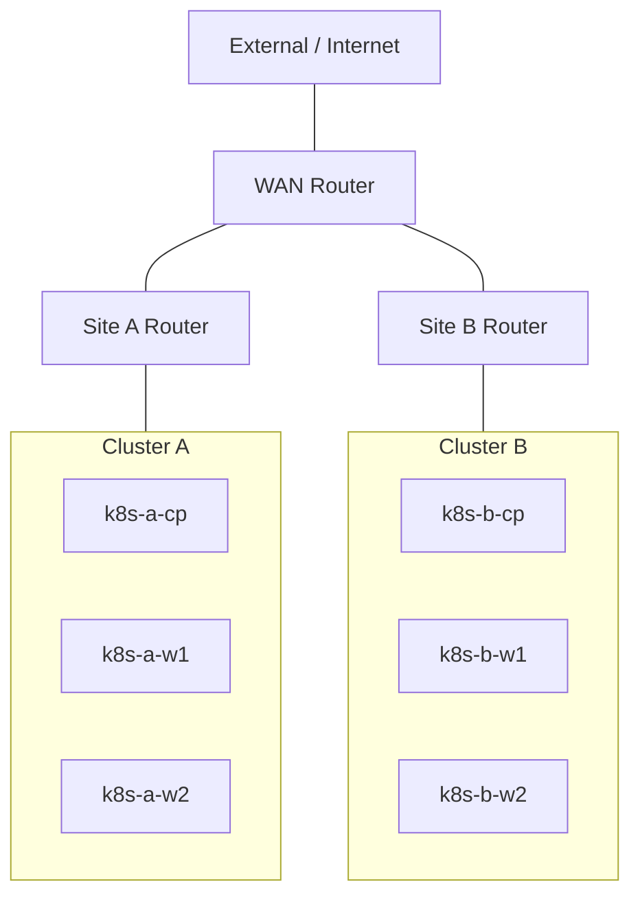
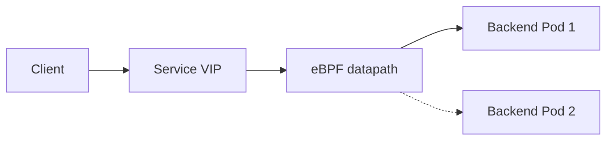
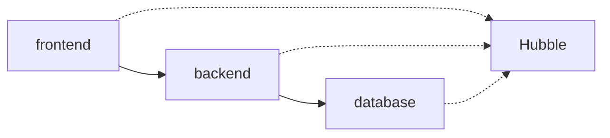
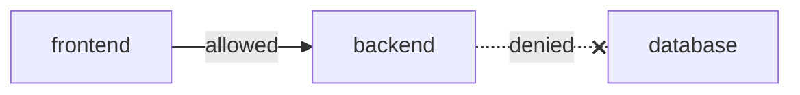
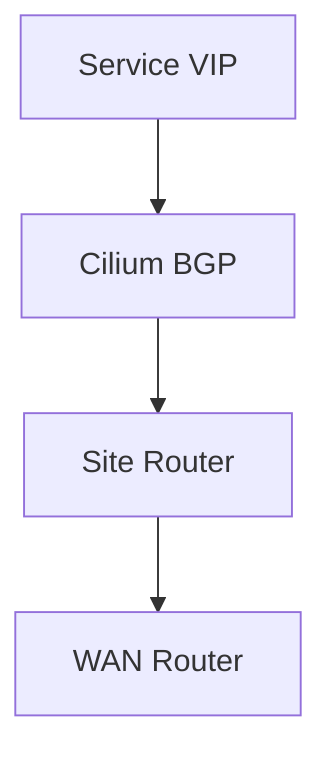
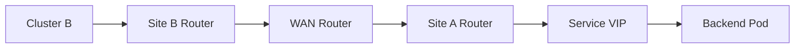

# Modeling Cloud-Native Networking  
## with Kubernetes, Cilium, and Cisco Modeling Labs

Your Name  
Cisco Live Session ID  

---

# Why Kubernetes Networking Feels Different

- Pods don't have MAC addresses  
- IP addresses appear and disappear  
- No obvious VLANs  
- Traffic paths feel invisible  
- Traditional tools feel incomplete  

Speaker Note:
Let the audience nod here. This is your alignment moment.

---

# The Core Claim

## Kubernetes Networking  
## **Is Linux Networking**

- Network namespaces  
- Virtual interfaces  
- Routing tables  
- Policy enforcement  

Speaker Note:
This is your thesis slide.

---

# How We'll Learn This

## Step-by-Step Progression

1 — Pod Networking  
2 — Services  
3 — Observability  
4 — Policy  
5 — Routed Integration  

Speaker Note:
Make it clear this builds progressively.

---

# The Lab We'll Use



Speaker Note:
"This is a real routed environment, not a toy cluster."

---

# Demo 1 — Pod Networking Fundamentals

## What Is a Pod?

A pod is:

- A Linux network namespace  
- With virtual interfaces  
- Attached to a node  
- Assigned an IP address  

---

# Pod-to-Pod Packet Walk


Speaker Note:
Walk through each arrow slowly.

---

# Pod CIDRs and Routing

Each node:

- Owns a Pod CIDR  
- Routes to other Pod CIDRs  
- Participates in cluster routing  

Speaker Note:
Tie this directly to Linux routing tables.

---

# Demo 1 Takeaway

## Kubernetes Networking  
## = Automated Linux Networking

- Namespaces  
- Interfaces  
- Routes  

---

# Demo 2 — Service Networking

## What Is a Kubernetes Service?

A Service provides:

- A Virtual IP  
- Backend Pods  
- Traffic distribution  

---

# Service VIP Behavior



Speaker Note:
Explain distributed load balancing.

---

# Traditional Networking Analogy

| Kubernetes | Networking |
|-------------|-------------|
| Service VIP | Load balancer VIP |
| Pod | Server |
| Node datapath | Distributed LB |

Speaker Note:
This anchors understanding.

---

# Introducing eBPF

eBPF programs:

- Run in kernel space  
- Select backend pods  
- Enable efficient routing  

Speaker Note:
Mention performance benefits.

---

# Demo 2 Takeaway

## Services behave like  
## distributed load balancers.

---

# Demo 3 — Observability

## Why Visibility Matters

Without visibility:

- Troubleshooting is guesswork  
- Performance tuning is difficult  
- Security enforcement is uncertain  

---

# Traditional vs Kubernetes Visibility

| Traditional | Kubernetes |
|-------------|-------------|
| NetFlow | Hubble |
| SPAN | eBPF |
| Logs | Flow visibility |

---

# What Hubble Shows



Speaker Note:
Explain flow visibility.

---

# Layer 7 Visibility

Hubble can observe:

- HTTP requests  
- URLs  
- Response codes  
- Identity context  

Speaker Note:
This is a big "wow" factor.

---

# Demo 3 Takeaway

## eBPF Enables  
## Deep, Real-Time Visibility

---

# Demo 4 — Identity-Based Policy

## Default Kubernetes Behavior

```
Any pod → Any pod
```

Speaker Note:
Pause for effect.

---

# Introducing Zero Trust

Zero Trust:

- Deny by default  
- Allow explicitly  
- Verify continuously  

---

# Identity vs IP-Based Policy

| IP-Based | Identity-Based |
|----------|----------------|
| Static | Dynamic |
| Fragile | Portable |
| Hard to maintain | Scalable |

---

# Policy Model



Speaker Note:
Set expectations before live failure.

---

# Demo 4 Takeaway

## Policies Follow  
## Workloads — Not IPs

---

# Demo 5 — Routed Integration

## Kubernetes Meets Routing

Services can:

- Have routable IPs  
- Be advertised via BGP  
- Be reached externally  

---

# Service Advertisement



Speaker Note:
Explain route propagation.

---

# Cross-Site Traffic Flow



Speaker Note:
Narrate each hop.

---

# Kubernetes as a Routing Domain

## Clusters behave like  
## routed networks.

Speaker Note:
This is a major conceptual payoff.

---

# Demo 5 Takeaway

## Kubernetes integrates  
## directly with routed infrastructure.

---

# What You Learned

1 — Kubernetes = Linux networking  
2 — Services = distributed load balancers  
3 — eBPF = visibility  
4 — Policy = zero trust  
5 — BGP = integration  

---

# Why Cisco Modeling Labs Matters

## Build → Test → Break → Learn

- Safe experimentation  
- Realistic topologies  
- Repeatable labs  

---

# Key Message

## Cloud-Native Networking  
## Builds on What You Already Know

---

# Resources

- GitHub repository  
- Lab instructions  
- Cilium documentation  
- Kubernetes documentation  

---

# Questions

## Questions?

Thank you.
